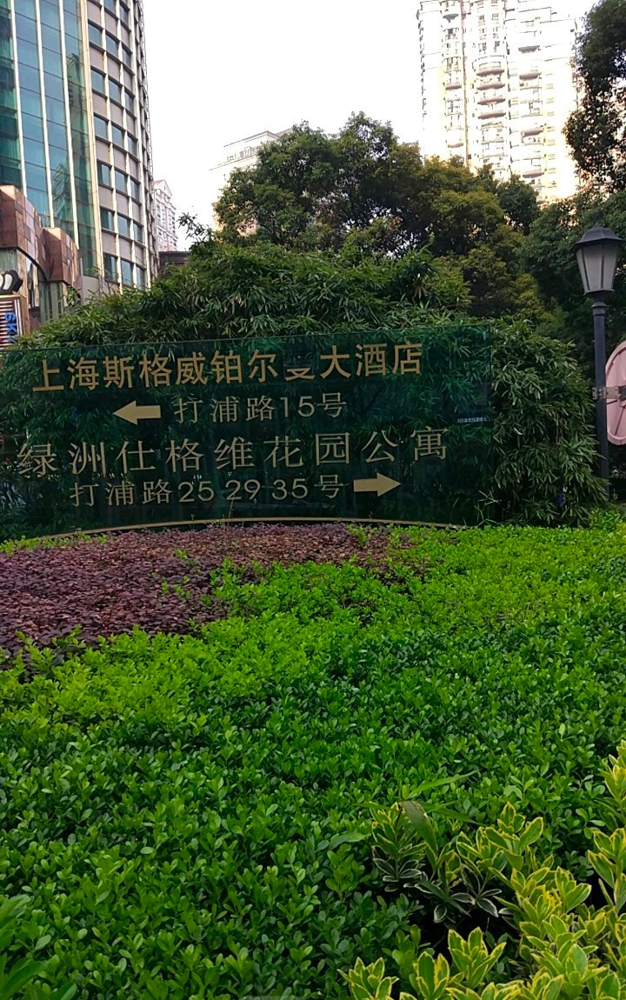
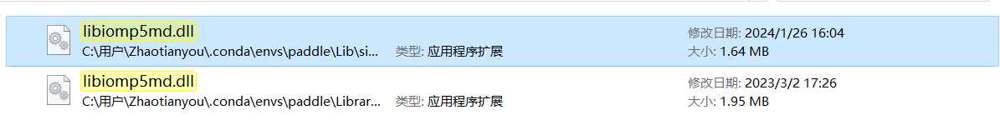

# trying-paddleOCR
## 这是我第一次尝试运行paddleOCR，下面是三个主要步骤
1、安装paddleocr

2、一行命令运行DB算法得到检测结果

3、可视化文本检测结果

### 1、安装paddleocr whl包
`pip install --upgrade pip`

`pip install paddleocr -i https://mirror.baidu.com/pypi/simple`

### 2、一行命令运行DB算法得到检测结果

接下来我就开心的开始运行paddleocr了。
但是我在运行的时候遇到了一些问题，我在这里记录一下。
我遇到了下面这个报错

`ValueError: The truth value of an array with more than one element is ambiguous. Use a.any() or a.all()`

起初我并不知到这个报错的原因，查询的相关资料后才知道，当一个数组有多个元素时，无法确定整个数组的真值，所以需要使用any()或者all()来判断整个数组的真值，这个错误通常发生在使用 NumPy 的布尔索引时。
下面是一个错误的例子：
```python
import numpy as np
a = np.array([1,2,3])
b = np.array([4,5,6]) 
if a==b :
    pass
```
输出结果为：
```
Traceback (most recent call last):
  File "D:\mycode\trying-paddleOCR-\2.py", line 4, in <module>
    if a==b :
ValueError: The truth value of an array with more than one element is ambiguous. Use a.any() or a.all()
```
下面是一个 正确例子：
```python
import numpy as np
a = np.array([1,2,3])
b = np.array([4,5,6])
print(a==b)
print((a==b).any())
print((a==b).all())
```
输出结果为：
```
[False False False]
False
False
```
这个错误的原因是因为在paddleocr的代码中有一个地方使用了这个错误的写法，
所以需要修改一下这个地方的代码，
此代码在paddleocr的paddleocr.py文件中的第674行，
`C:\Users\Zhaotianyou\.conda\envs\paddle\Lib\site-packages\paddleocr\paddleocr.py`如下所示：
```python
                if not dt_boxes:
                    ocr_res.append(None)
                    continue
                tmp_res = [box.tolist() for box in dt_boxes]
                ocr_res.append(tmp_res)
            return ocr_res
```
将`if not dt_boxes:`改为`if not dt_boxes.all():`，这样就可以解决这个问题了。
```python
                if dt_boxes.size == 0 or not dt_boxes.any():
                    ocr_res.append(None)
                    continue
                tmp_res = [box.tolist() for box in dt_boxes]
                ocr_res.append(tmp_res)
            return ocr_res
```
另外一个解决办法是把paddleocr版本降到2.6.0.1就没问题了。

初次运行时，paddleocr会自动下载并使用PaddleOCR的PP-OCRv2轻量级模型。
使用安装好的paddleocr 以12.jpg为输入图像，将得到以下预测结果：

```python
[2024/02/03 14:53:55] ppocr INFO: [[75.0, 553.0], [448.0, 540.0], [449.0, 572.0], [77.0, 585.0]]
[2024/02/03 14:53:55] ppocr INFO: [[18.0, 506.0], [514.0, 488.0], [516.0, 533.0], [20.0, 550.0]]
[2024/02/03 14:53:55] ppocr INFO: [[187.0, 457.0], [398.0, 448.0], [400.0, 481.0], [188.0, 490.0]]
[2024/02/03 14:53:55] ppocr INFO: [[40.0, 413.0], [483.0, 390.0], [485.0, 431.0], [42.0, 453.0]]
```
预测结果一共包含四个文本框，每一行包含四个坐标点，代表一个文本框的坐标集合，从左上角起以顺时针顺序排列。

paddleocr命令行调用文本检测模型预测图像12.jpg的方式如下：
```python
--image_dir 指向要预测的图像路径  --rec false表示不使用识别识别，只执行文本检测
paddleocr --image_dir 12.jpg --rec false
paddleocr --image_dir 12.jpg
```
### 3、可视化文本检测结果


## 奇怪的报错

完成操作以后，莫名其妙的出现了另外一个报错，程序突然无法运行了，报错如下：
```python
OMP: Error #15: Initializing libiomp5md.dll, but found libiomp5md.dll already initialized.
OMP: Hint This means that multiple copies of the OpenMP runtime have been linked into the program. That is dangerous, since it can degrade performance or cause incorrect results. T
```
查询了资料后明白，这个错误的原因是因为在程序中同时引用了多个OpenMP运行时库，解决这个问题的方法是在程序中添加下面代码：
```python
import os
os.environ['KMP_DUPLICATE_LIB_OK']='True'
```
另一种方法是在`C:\Users\Zhaotianyou\.conda\envs\`路径下搜索`libiomp5md.dll`，会出现两个相同的文件：

移除第二个文件，然后再次运行程序，就可以解决这个问题了。

第二个文件路径为：
`C:\Users\Zhaotianyou\.conda\envs\paddle\Library\bin`

移动至：
`C:\Users\Zhaotianyou\Desktop`